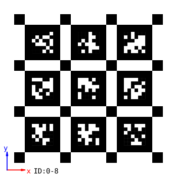

# AprilTagGenerator 
## PDF or SVG, Vectorgraph, with GUI

An AprilTag based Camera Calibration Board Vectorgraph Pattern Generator Based on Qt 



download [id_0-8_size_40.00cmx40.00cm.svg](./id_0-8_size_40.00cmx40.00cm.svg)

download [id_0-8_size_40.00cmx40.00cm.pdf](./id_0-8_size_40.00cmx40.00cm.pdf)

## Prerequest

Apriltags cpp library (originally from [MIT](http://people.csail.mit.edu/kaess/apriltags/)): [huangqinjin/apriltags](https://github.com/huangqinjin/apriltags) or [wangdongustc/apriltags](https://github.com/wangdongustc/apriltags)

You might need [OpenCV](https://github.com/opencv/opencv/) when building the apriltags library, but actually this project only uses the header files of the apriltags library.

Qt5 Widgets, Svg and Gui are needed to show the GUI and generate the SVG or PDF Vectorgraph Pattern.

Also this project uses cmake to manage the building process.

## Build and Run

Run the following in your favorite shell, then things should work if no error happens: 
```
cd path/to/this/project
mkdir build
cd build 
cmake ..
make -j4
./AprilTagGenerator
```

## Notice
Tags are arranged in a way that the start id comes in the bottom-left corner and the id increases from left to right and from rows to cols.

e.g. a 3x3 tag pattern starting from id 0 is arranged in the following way:
```
6 7 8
3 4 5
0 1 2
```

"Unit"  means the smallest unit in the tag

"Border" means the most outer black border of each tag

"Corner Box" means the black boxes on the corner of the tags between them

"Padding" means the space between the edge of the entire painting and the tags

"DPI" means Dots Per Inch, on default it was set to 254 to make the output size looks better in cm. But one can always easily change the scale before printing.

